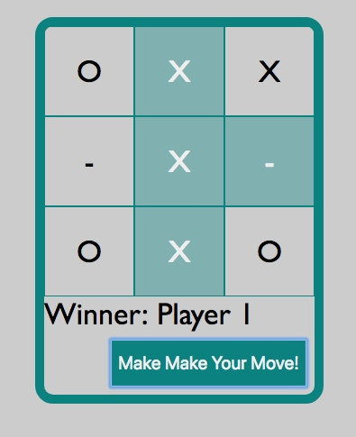

# Projects

## [Business Statistics Application](https://github.com/HamidHeyde/ReactJs/tree/master/Business%20Statistics)
This is an application for managing Business statistics presented as Charts.(Bar,Pie,etc.) Each chart has it's own window, which is draggable. So, one could change the charts' order according to user's priority. Each chart can be independently customized.

Through this project Business Statistics application is implemented using 2 following approaches: (So, using the same logic, there would be way to compare these approaches from implementation point-of-view)

* [Javascript](https://github.com/HamidHeyde/ReactJs/tree/master/Business%20Statistics/JavaScript)
using traditional JavaScript, HTML, CSS, this app has been implemented

* [React](https://github.com/HamidHeyde/ReactJs/tree/master/Business%20Statistics/React)
Through this approach, the same logic has been implemented, without using any dependencies. Using this approach we can easily start developing React application without installing any other dependencins and view the final product through running the index.html

## [Tic Tac Toe](https://github.com/HamidHeyde/ReactJs/tree/master/TicTacToe)
Through this project "Tic Tac Toe" game is implemented using 3 following approaches: (So, using the same logic, there would be way to compare these approaches from implementation point-of-view)

* [Javascript](https://github.com/HamidHeyde/ReactJs/tree/master/TicTacToe/JavaScript)
using traditional JavaScript, HTML, CSS, this game has been implemented
* [React](https://github.com/HamidHeyde/ReactJs/tree/master/TicTacToe/React)
Using [Create React App]] this game has been implemented [same logic]. In this package react has been deployed along with other dependencies. The application is implemented through App.js, App.css, helpers.js.
* [React No ES6](https://github.com/HamidHeyde/ReactJs/tree/master/TicTacToe/ReactNoEs6)
Through this approach, the same logic has been implemented, without using any dependencies. Using this approach we can easily start developing React application without installing anyother dependencins and view the final product through running the index.html

## [FAQ](https://github.com/HamidHeyde/ReactJs/tree/master/FAQ)
Through this project FAQ application is implemented using 2 following approaches: (So, using the same logic, there would be way to compare these approaches from implementation point-of-view)

* [Javascript](https://github.com/HamidHeyde/ReactJs/tree/master/FAQ/JavaScript)
using traditional JavaScript, HTML, CSS, this app has been implemented
* [React](https://github.com/HamidHeyde/ReactJs/tree/master/FAQ/React)
Through this approach, the same logic has been implemented, without using any dependencies. Using this approach we can easily start developing React application without installing any other dependencins and view the final product through running the index.html